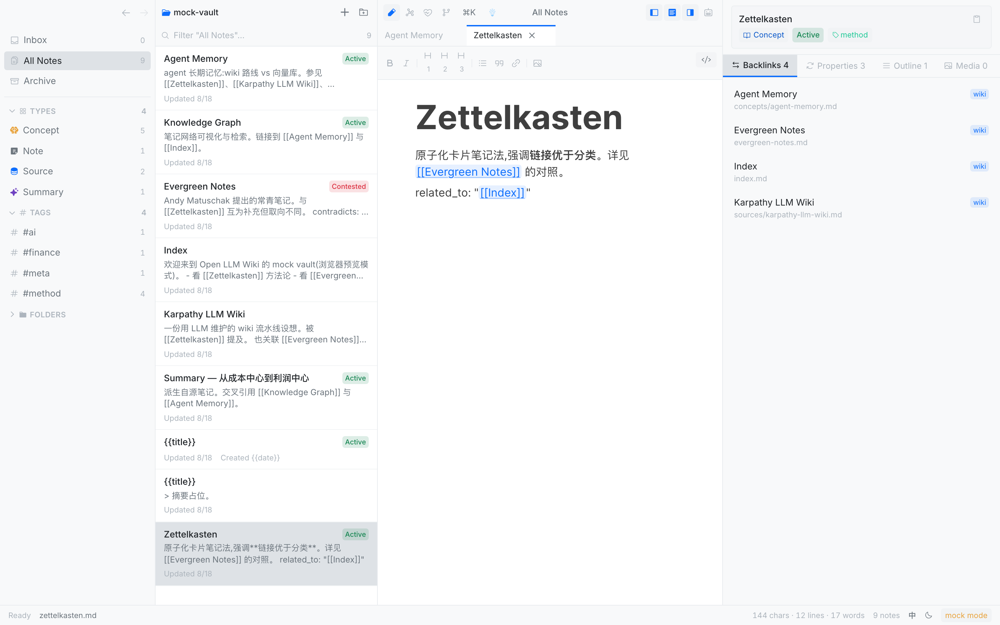
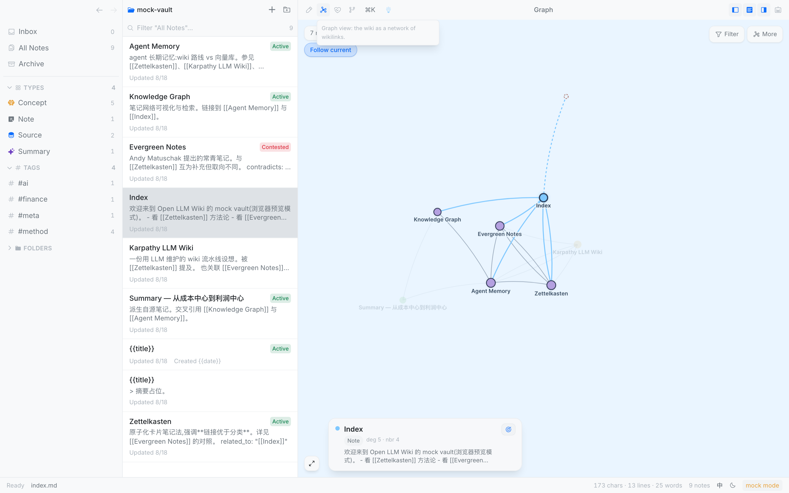
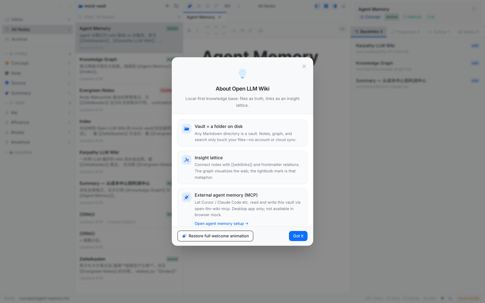

<div align="center">


# Open LLM Wiki

**Local-first knowledge base. Your Markdown files are the only source of truth.**

Dual-mode editor. Native graph. Vault health. In-app agent. Built-in MCP.<br />
No account. No cloud. Apache-2.0.

<br />

[](https://github.com/rhythm1995/open-llm-wiki/actions)
[](https://github.com/rhythm1995/open-llm-wiki/actions/workflows/site.yml)
[](./LICENSE)
[](https://github.com/rhythm1995/open-llm-wiki/stargazers)
[](https://github.com/rhythm1995/open-llm-wiki/issues)
[](https://github.com/rhythm1995/open-llm-wiki/releases)

<!-- README-I18N:START -->

**English** | [简体中文](./README.zh.md)

<!-- README-I18N:END -->

[Website](https://rhythm1995.github.io/open-llm-wiki/)
· [User guide](./docs/user/README.md)
· [Releases](https://github.com/rhythm1995/open-llm-wiki/releases)
· [Issues](https://github.com/rhythm1995/open-llm-wiki/issues)

</div>

<p align="center">
  
</p>
<p align="center"><sub>Three-pane editor. Notes stay plain Markdown on disk.</sub></p>

---

## Why this exists

Most knowledge apps either lock the engine or push you into a query language. Open LLM Wiki is an **original Apache-2.0 desktop app** that treats the filesystem as truth and makes two missing pieces native: a **relationship graph** and **live aggregation you can trust without writing QQL**.

A vault is a folder. Leave whenever you want. Take the files with you.

| | Open LLM Wiki | Typical closed notes app |
| --- | --- | --- |
| Files | Plain `.md` + frontmatter on disk | Files plus a proprietary engine |
| License | Apache-2.0, original source | Closed core |
| Graph | Native, first-class | Weak, or a plugin |
| Queries | Health board + Ask Agent | Human-facing DSL |
| AI | In-app ACP + 8 MCP tools | Bolt-on plugin |
| Sync | Your git | Vendor cloud |

Obsidian is a public feature comparison only. This repo does not copy its source.

## Highlights

<details>
<summary><strong>Dual-mode editor</strong> — source and WYSIWYG, lossless round-trip</summary>

<br />

CodeMirror 6 for Markdown source. BlockNote for WYSIWYG. `[[wikilink]]` complete, follow, and backlinks. Paste or drag images into `attachments/`. Find, outline, split reading preview.

</details>

<details>
<summary><strong>Insight lattice</strong> — the graph is a product surface, not a demo</summary>

<br />

<p align="center">
  
</p>

Wikilinks and frontmatter relations render as an interactive network. Force layout, type layers, timeline. Click a node, follow the current note, filter by type or tag.

</details>

<details>
<summary><strong>Vault health</strong> — scores and a next action, no query language to learn</summary>

<br />

<p align="center">
  
</p>

Six live scores from the graph. Eleven locked checks grouped as structure / evidence / trust. Hungriest claims and a next-action line. Ad-hoc questions go to **Ask Agent**. There is no QueryPanel.

</details>

<details>
<summary><strong>Agents, two paths</strong> — in-app sidebar or any MCP client</summary>

<br />

<p align="center">
  
</p>

- **In-app:** ACP session, recipe picker (opencode, claude-code, …), three-tier permissions, `@`-note context, git snapshots per turn.
- **External:** built-in `open-llm-wiki-mcp` with 8 tools (`list_notes`, `read_note`, `write_note`, `links`, `search_notes`, `run_qql`, `vault_info`, `lint_vault`). One-click memory onboarding in Settings.

Raw transcripts stay out of the vault. Only files you (or the agent via `write_note`) write become knowledge.

</details>

<details>
<summary><strong>Command palette and search</strong></summary>

<br />

<p align="center">
  
</p>

`⌘K` commands · `⌘P` quick-open · `⌘⇧F` full-text search · `⌘O` open vault · `⌘,` settings.

</details>

Also included: git status / commit / pull / push when the vault is a repo, Excalidraw canvas, embedded sheets, 简体中文 / English UI.

## Getting started

### 1. Browser preview (fastest)

No Rust. In-memory mock vault.

```bash
git clone https://github.com/rhythm1995/open-llm-wiki.git
cd open-llm-wiki
pnpm install --dir ui
pnpm --dir ui dev          # http://localhost:5173
```

### 2. Desktop app from source (real files)

```bash
pnpm install --dir ui
pnpm build:app             # → target/release/bundle/macos/Open LLM Wiki.app
open "target/release/bundle/macos/Open LLM Wiki.app"
```

Full Tauri dev loop (from the **repo root**, not `ui/`):

```bash
ui/node_modules/.bin/tauri dev
```

> [!IMPORTANT]
> Tauri config lives in `app/src-tauri/`. `pnpm --dir ui exec tauri` changes CWD and discovery fails.

### 3. Prebuilt macOS app

From [Releases](https://github.com/rhythm1995/open-llm-wiki/releases), drag `Open LLM Wiki.app` to `/Applications`. Builds are **unsigned**:

```bash
xattr -cr "/Applications/Open LLM Wiki.app"
```

Or *System Settings → Privacy & Security → Open Anyway*. macOS 10.15+. Bundle ID `dev.openllmwiki.desktop` — replace the old copy.

Then open a Markdown folder, or create the sample wiki. Click the toolbar logo for the in-app overview.

<p align="center">
  
</p>

## User guide

The handbook is Markdown in this repo. The [website](https://rhythm1995.github.io/open-llm-wiki/docs/start) renders the same files.

| You want to… | Open |
| --- | --- |
| First fifteen minutes | [Tutorial](./docs/user/tutorial.md) |
| Finish a specific job | [How-to](./docs/user/how-to.md) |
| Shortcuts, views, types, MCP | [Reference](./docs/user/reference.md) |
| Why files are the truth | [Concepts](./docs/user/concepts.md) |

Contributor / agent specs: [docs/](./docs/README.md).

## Architecture

```
ui (React 19 + Vite + Tailwind 4 + CodeMirror 6 + BlockNote)
        │  IPC (@tauri-apps/api invoke)
        ▼
app/src-tauri (Tauri 2 shell: file IO + commands, no business logic)
        ▼
core (Rust: parse / graph / search — pure logic, IO-free, TDD)
```

| Crate / dir | Role |
| --- | --- |
| `core/` | Pure functions. No IO. Unit tests + proptest. |
| `app/src-tauri/` | Files, git, core, ACP. New commands register in `run()`. |
| `mcp/` | stdio MCP server for external agents. |
| `ui/` | Three-pane app. Browser dev uses `src/lib/mock.ts`. |
| `site/` | Marketing site. Reads `docs/user` at build time. |
| `templates/wiki-starter/` | Source / Summary / Entity / Concept / Health scaffold. |

Stack: [Tauri 2](https://tauri.app/) · [React 19](https://react.dev/) · [CodeMirror 6](https://codemirror.net/) · [BlockNote](https://blocknotejs.org/) · [force-graph](https://github.com/vasturiano/force-graph) · [Excalidraw](https://excalidraw.com/) · [ironcalc](https://www.ironcalc.com/)

## Status

This is a technical beta (`0.1.0`). Useful today. Honest limits:

- Unsigned macOS builds. No auto-update.
- Graph is functional, not commercial-polish (layout persistence and shortest-path highlight are deferred).
- Browser mock does not evaluate Health QQL details. Graph scores still work.
- Windows / Linux build from source. Prebuilt focus is macOS.

## Community

- Website: [rhythm1995.github.io/open-llm-wiki](https://rhythm1995.github.io/open-llm-wiki/)
- Bugs and ideas: [Issues](https://github.com/rhythm1995/open-llm-wiki/issues)
- New dependencies go in [THIRD_PARTY_NOTICES](./THIRD_PARTY_NOTICES.md). No PR may introduce verbatim copyleft source.

If this is useful, star the repo so other people can find a local-first wiki that stays files.

<p align="center">
  <a href="https://star-history.com/#rhythm1995/open-llm-wiki&Date">
    <picture>
      <source media="(prefers-color-scheme: dark)" srcset="https://api.star-history.com/svg?repos=rhythm1995/open-llm-wiki&type=Date&theme=dark" />
      <source media="(prefers-color-scheme: light)" srcset="https://api.star-history.com/svg?repos=rhythm1995/open-llm-wiki&type=Date" />
      
    </picture>
  </a>
</p>
