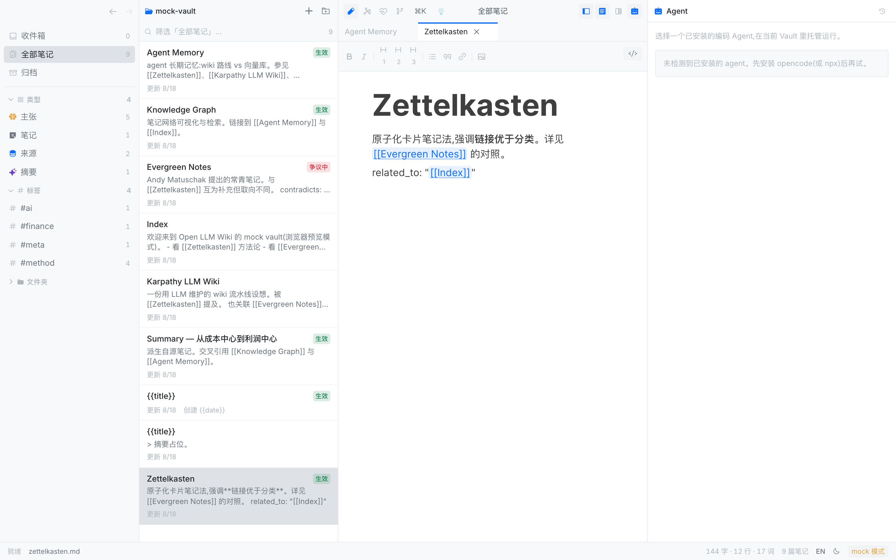
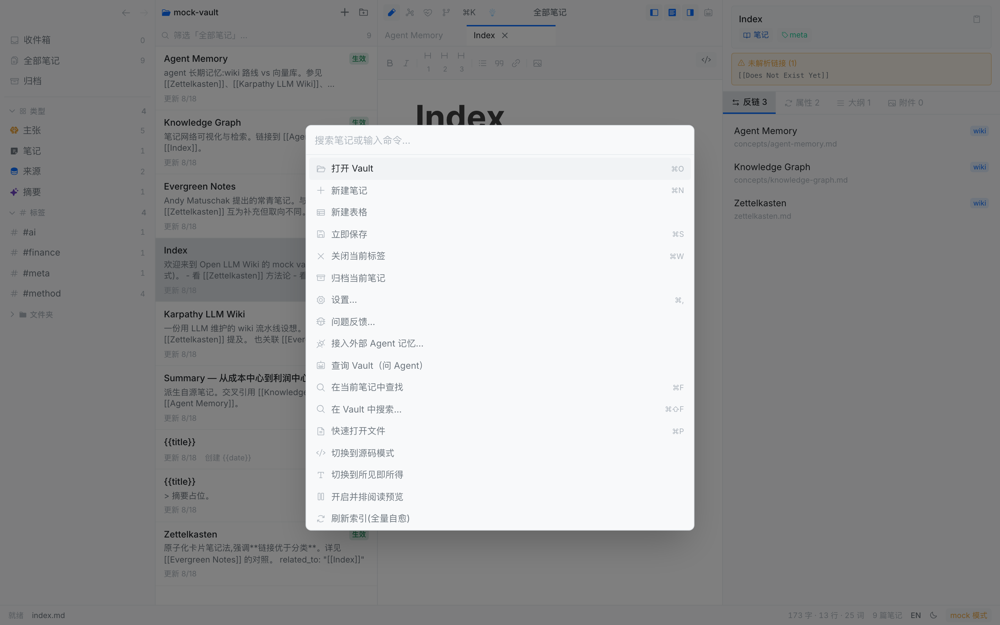

<div align="center">


# Open LLM Wiki

**本地优先的知识库。你的 Markdown 文件就是唯一真相。**

双模编辑器。原生图谱。库健康。应用内 Agent。内置 MCP。<br />
无需账号。没有云。Apache-2.0。

<br />

[](https://github.com/rhythm1995/open-llm-wiki/actions)
[](https://github.com/rhythm1995/open-llm-wiki/actions/workflows/site.yml)
[](./LICENSE)
[](https://github.com/rhythm1995/open-llm-wiki/stargazers)
[](https://github.com/rhythm1995/open-llm-wiki/issues)
[](https://github.com/rhythm1995/open-llm-wiki/releases)

<!-- README-I18N:START -->

[English](./README.md) | **简体中文**

<!-- README-I18N:END -->

[官网](https://rhythm1995.github.io/open-llm-wiki/?lang=zh)
· [用户文档](./docs/user/README.zh.md)
· [Releases](https://github.com/rhythm1995/open-llm-wiki/releases)
· [Issues](https://github.com/rhythm1995/open-llm-wiki/issues)

</div>

<p align="center">
  
</p>
<p align="center"><sub>三栏编辑器。笔记就是磁盘上的纯 Markdown。</sub></p>

---

## 为什么做这个

多数「LLM + 文档」产品在提问时检索片段，把综合扔掉。下一问又从零开始。不以模型为卖点的知识应用，通常要么锁死引擎，要么让你学一门查询语言。

Open LLM Wiki 是**原创的 Apache-2.0 桌面应用**，走另一条回路：在你和原始材料之间，维护一座持久的 Markdown wiki。提炼是编译，库健康是 lint。同一座文件夹也是应用内 Agent、以及 Cursor / Claude Code（内置 MCP）的长期记忆。文件系统是唯一真相。图谱和即时分数是原生的——你不用写 QQL。

Vault 就是一个文件夹。想走，带上文件即可。

| | Open LLM Wiki | 常见的其它选择 |
| --- | --- | --- |
| 文件 | 磁盘上的纯 `.md` + frontmatter | 文件加专有引擎 |
| 许可 | Apache-2.0，原创源码 | 闭源内核 |
| 图谱 | 原生一等公民 | 偏弱，或靠插件 |
| 查询 | 库健康 + 问 Agent | 给人用的 DSL，或提问时现检索 |
| AI | Vault 就是记忆（MCP + ACP） | 聊天记录或外挂插件 |
| 同步 | 你自己的 git 或任意同步工具 | 厂商云 |

## 原则

产品约束，不是功能清单。展开写在 [概念](./docs/user/concepts.zh.md)。

- **文件即真相。** Vault 是一夹 Markdown。没有账号，没有第二份库。列表、图谱、健康分都从这些文件算。想走，带走文件夹。
- **编译，不要每次检索。** 源消化一次。问 wiki。用库健康做 lint。有用的回答写回文件。不要每问一次都从片段重做综合。
- **Vault 就是记忆。** 应用内 ACP，以及一键 MCP（Cursor、Claude Code 和八个工具）读写同一批文件。聊天不是记忆。`hot.md` 只是短缓存。
- **链接优先于文件夹。** 关系写在 `[[wikilink]]` 和 frontmatter。`type:` / `status:` 只是标签，从不挡保存。
- **库健康，不是查询语言。** 人看到分数、锁定检查、下一步。QQL 留给程序和 Agent。

## 亮点

<details>
<summary><strong>双模编辑</strong> — 源码与所见即所得，往返不丢内容</summary>

<br />

CodeMirror 6 写 Markdown 源码，BlockNote 做所见即所得。`[[wikilink]]` 补全、跳转、反链。粘贴或拖入图片进 `attachments/`。查找、大纲、并排阅读。

</details>

<details>
<summary><strong>洞察晶格</strong> — 图谱是产品面，不是演示</summary>

<br />

<p align="center">
  
</p>

Wikilink 和 frontmatter 关系画成可交互网络。力导向、按类型分层、时间轴。点节点、跟随当前笔记、按类型或标签过滤。

</details>

<details>
<summary><strong>库健康</strong> — 分数和下一步，不必学查询语言</summary>

<br />

<p align="center">
  
</p>

图谱即时六格分数。十一条锁定检查，按结构 / 证据 / 信任分组。最饿主张和下一动作。临时问题走 **问 Agent**。没有 QueryPanel。

</details>

<details>
<summary><strong>Vault 就是记忆</strong> — 应用内 Agent，或任意 MCP 客户端</summary>

<br />

<p align="center">
  
</p>

- **应用内：** ACP 会话、配方 picker（opencode、claude-code …）、权限三档、`@` 笔记上下文、每轮 git 快照。
- **外部：** 内置 `open-llm-wiki-mcp`，8 个工具（`list_notes`、`read_note`、`write_note`、`links`、`search_notes`、`run_qql`、`vault_info`、`lint_vault`）。设置里一键接入记忆。

原始转录不进 vault。只有你（或 Agent 经 `write_note`）写下的文件才成为知识。

</details>

<details>
<summary><strong>命令面板与搜索</strong></summary>

<br />

<p align="center">
  
</p>

`⌘K` 命令 · `⌘P` 快开 · `⌘⇧F` 全文搜索 · `⌘O` 打开库 · `⌘,` 设置。

</details>

另外还有：vault 是 git 仓库时的 status / commit / pull / push，Excalidraw 画布，嵌入式表格，简体中文 / English 界面。

## 快速开始

### 1. 浏览器预览（最快）

不用编 Rust。内存演示库。

```bash
git clone https://github.com/rhythm1995/open-llm-wiki.git
cd open-llm-wiki
pnpm install --dir ui
pnpm --dir ui dev          # http://localhost:5173
```

### 2. 从源码打桌面应用（真文件）

```bash
pnpm install --dir ui
pnpm build:app             # → target/release/bundle/macos/Open LLM Wiki.app
open "target/release/bundle/macos/Open LLM Wiki.app"
```

完整 Tauri 开发循环（必须从**仓库根**启动，不要进 `ui/`）：

```bash
ui/node_modules/.bin/tauri dev
```

> [!IMPORTANT]
> Tauri 配置在 `app/src-tauri/`。`pnpm --dir ui exec tauri` 会改 CWD，发现失败。

### 3. 预编译 macOS 应用

从 [Releases](https://github.com/rhythm1995/open-llm-wiki/releases) 取 `Open LLM Wiki.app`，拖入 `/Applications`。构建**未签名**：

```bash
xattr -cr "/Applications/Open LLM Wiki.app"
```

或：系统设置 → 隐私与安全性 → 仍要打开。macOS 10.15+。Bundle ID 为 `dev.openllmwiki.desktop`，请替换旧版。

然后打开一个 Markdown 文件夹，或创建示例知识库。点顶栏 logo 打开应用内简介。

<p align="center">
  
</p>

## 用户文档

手册就是本仓库里的 Markdown。[官网](https://rhythm1995.github.io/open-llm-wiki/docs/start?lang=zh)渲的是同一批文件。

| 你想… | 打开 |
| --- | --- |
| 先做十五分钟 | [教程](./docs/user/tutorial.zh.md) |
| 完成一件具体的事 | [操作指南](./docs/user/how-to.zh.md) |
| 快捷键、视图、类型、MCP | [参考](./docs/user/reference.zh.md) |
| 理解「文件即真相」 | [概念](./docs/user/concepts.zh.md) |

贡献者 / agent 规格：[docs/](./docs/README.zh.md)。

## 架构

```
ui (React 19 + Vite + Tailwind 4 + CodeMirror 6 + BlockNote)
        │  IPC (@tauri-apps/api invoke)
        ▼
app/src-tauri (Tauri 2 薄壳：文件 IO + 命令，无业务逻辑)
        ▼
core (Rust：解析 / 图谱 / 检索 —— 纯逻辑，IO-free，TDD)
        ▲
        │  同一个 core，同一批文件
外部 Agent（Cursor / Claude Code / …）──► mcp/（stdio MCP server）
```

| 目录 | 作用 |
| --- | --- |
| `core/` | 纯函数。无 IO。单测 + proptest。 |
| `app/src-tauri/` | 文件、git、core、ACP。新命令注册进 `run()`。 |
| `mcp/` | 给外部 agent 的 stdio MCP。 |
| `ui/` | 三栏应用。浏览器开发走 `src/lib/mock.ts`。 |
| `site/` | 营销站。构建时读 `docs/user`。 |
| `templates/wiki-starter/` | Source / Summary / Entity / Concept / Health 脚手架。 |

技术栈：[Tauri 2](https://tauri.app/) · [React 19](https://react.dev/) · [CodeMirror 6](https://codemirror.net/) · [BlockNote](https://blocknotejs.org/) · [force-graph](https://github.com/vasturiano/force-graph) · [Excalidraw](https://excalidraw.com/) · [ironcalc](https://www.ironcalc.com/)

## 现状

技术 beta（`0.1.0`）。今天就能用。限制如实写：

- macOS 构建未签名。无自动更新。
- 图谱可用，未做到商业精致（布局落盘、最短路径高亮推迟）。
- 浏览器 mock 不跑库健康 QQL 明细。图谱分数仍可用。
- Windows / Linux 从源码构建。预编译先做 macOS。

## 社区

- 官网：[rhythm1995.github.io/open-llm-wiki](https://rhythm1995.github.io/open-llm-wiki/?lang=zh)
- 问题与想法：[Issues](https://github.com/rhythm1995/open-llm-wiki/issues)
- 新依赖登记 [THIRD_PARTY_NOTICES](./THIRD_PARTY_NOTICES.md)。PR 不得引入 copyleft 源码的逐字片段。

若它对你有用，给仓库点一颗星，让更多人能找到这座文件不会被锁走的本地 wiki。

<p align="center">
  <a href="https://star-history.com/#rhythm1995/open-llm-wiki&Date">
    <picture>
      <source media="(prefers-color-scheme: dark)" srcset="https://api.star-history.com/svg?repos=rhythm1995/open-llm-wiki&type=Date&theme=dark" />
      <source media="(prefers-color-scheme: light)" srcset="https://api.star-history.com/svg?repos=rhythm1995/open-llm-wiki&type=Date" />
      
    </picture>
  </a>
</p>
