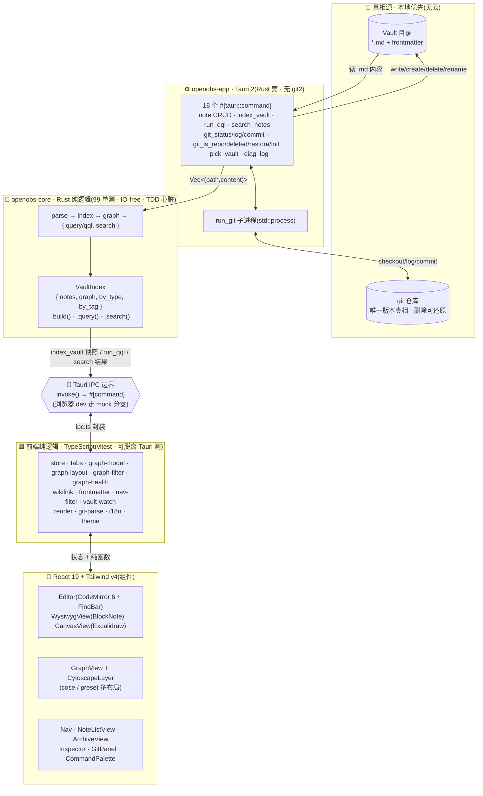
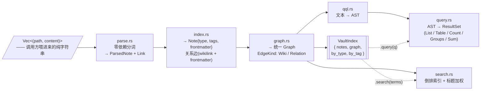

# 07 — LLM Wiki × 软件架构（双视角总览）

> 本文回答一个问题:**OpenObsidian 这个项目,把「LLM Wiki 方法论」和「它自己的软件架构」是怎么叠在一起的?**
>
> 它既是 (a) 一个有清晰分层的软件(`core` Rust 内核 → `app` Tauri 壳 → `ui` React 前端),
> 又是 (b) 一套**实现 LLM Wiki 思想**的本地引擎(Raw → Wiki → Schema → Navigation → Health)。
> 两个视角不是两件事——后者就**长在**前者的分层里。本文把两者画进同一张图。
>
> 与既有文档的关系:技术栈选型见 [02-architecture](./02-architecture.md),数据模型(Vault/Note/frontmatter)
> 见 [03-data-model](./03-data-model.md)。本文是**横切总览**,不重复细节,只画"怎么拼起来"。
> 本文反映**代码落地真相**;02 的选型是初版设计,部分已调整(见下文「实现 vs 设计」)。

---

## 0. 一句话定位

> **OpenObsidian = 一个本地优先、文件即真相的引擎,用 Rust 纯逻辑内核把「笔记 + frontmatter 软类型」
> 索引成一张可查询的图谱,让 LLM Wiki 的五层（Raw / Wiki / Schema / Navigation / Health）都成为一等公民——
> 尤其是 Health 层,它不靠手写快照,而靠 QQL 聚合查询实时算出来。**

---

## 1. 主架构图(软件栈 + 数据流)



> **读图要点**:`core` 是纯函数心脏,不碰文件系统/git/网络——所有副作用都挤到 `app` 层的命令处理器和
> `run_git` 子进程里。前端有一层**与后端对称的纯逻辑**(`lib/`),让 UI 交互可单测、可脱离 Tauri 跑
> (浏览器 dev 走 `mock.ts`)。这条"纯逻辑 IO-free"的对角线贯穿三层,是整个项目的结构主梁。

---

## 2. Core 内部流水线(索引是怎么炼成的)



> **关键**:`VaultIndex` 是顶层聚合——`build()` 一次性把 parse/index/graph/search 全跑完,产出不可变快照;
> `query()` / `search()` 是快照上的只读查询。Tauri 命令 `index_vault` 把这个快照序列化给前端;
> `run_qql` / `search_notes` 则是按需的窄查询(读 **LiveVault** 内存索引,不每次 WalkDir)。打开 vault 全量一次;写/删/改名/watcher 走路径级 delta。
> 可控(日常百~千级笔记)兜住——这是有意的简单取舍。

---

## 3. 视角二:LLM Wiki 五层 → OpenObsidian 机制

LLM Wiki(Karpathy 式)把知识库切成五层。下表把每一层**落**到 OpenObsidian 的具体类型 / 命令 / 组件上——
你会看到:前四层 OpenObsidian 已经原生支持,第五层(Health)是**用 QQL 把它从"手写快照"升级成"实时可查"**。

| LLM Wiki 层 | 含义 | OpenObsidian 的落点 | 类型 / 命令 / 组件 |
|---|---|---|---|
| **Raw** | 不可变原始源 | 笔记的 `type: Source`;不可变语义由 **git 版本真相**保证(re-ingest 产新 Summary,旧版可还原) | `type: Source` · `git_restore_note` · ArchiveView |
| **Wiki** | LLM 生成的派生知识 | `Summary` / `Entity` / `Concept` 软类型 + 关系边(`derived_into` / `mentioned_in` / `contradicts`) | `type: Summary\|Entity\|Concept` · Inspector 关系编辑 · GraphView |
| **Schema** | 类型与关系的契约 | `core::index` 解析 `type:`/frontmatter;`Type` 文档定义软类型;`AGENTS.md` 作 schema 提示(兼容 cairn) | `type_of()` · `relationship_links()` · Type 文档 · AGENTS.md |
| **Navigation** | 索引 / 目录 / 浏览 | **图谱**(Cytoscape)+ **QQL IR**(MCP `run_qql`,用户面 UI 已撤)+ **⌘F/⌘P/⌘K**+ Nav 智能视图 | GraphView/CytoscapeLayer · FindBar · CommandPalette · `index_vault` |
| **Health** | 度量与反馈环 | **用 QQL 实时算**,而非手写 wiki-health 快照 —— 见下文「Health 即查询」 | `run_qql` + saved `type: Query` 笔记 |

### Health 即查询(核心洞察)

传统 LLM Wiki 的 Health 层是一篇**手写刷新**的 `wiki-health` 快照(因为通用笔记工具没有原生聚合)。
OpenObsidian 把它变成**一等查询**——任何一个 Health 指标都是一条 QQL,存成 `type: Query` 的笔记,自举进图谱/检索:

| Health 指标 | 对应 QQL |
|---|---|
| 矛盾健康度(Contested 概念) | `WHERE type = "Concept" AND status = "Contested" SHOW title` |
| 孤儿(无入边的 Entity/Concept) | `WHERE type IN ("Entity", "Concept") AND mentioned_in.len() = 0 SHOW title` |
| 概念饥饿度(按引用深度排序,最浅在前) | `WHERE type = "Concept" SHOW title, mentioned_in.len() AS depth SORT mentioned_in.len() ASC` |
| 证据质量分布(按 tier 分组数 Source) | `WHERE type = "Source" RENDER group_by(evidence_tier)` |
| 综合度(单源 / 薄证据概念) | `WHERE type = "Concept" AND mentioned_in.len() < 2 SHOW title` |

> **语法要点**(对照 [core 的 QQL 语法](../core/src/qql.rs)):子句只有 `WHERE`/`SORT`/`LIMIT`/`SHOW`/`RENDER`,
> 顺序不限;**没有** `GROUP BY` 子句、**没有** `IS EMPTY` 运算符——分组是 `RENDER group_by(<字段>)`、
> 「空」用图算的反链入度 `mentioned_in.len() = 0` 表达(入度由正文 `[[wikilink]]` 生成,与 frontmatter 是否写了该键无关)。
> 字段长度统一写 `<字段>.len()`,如 `mentioned_in.len()`(不是 `len(mentioned_in)`)。
>
> 这五条作为可即用的 `type: Query` 笔记随 starter vault 交付([`templates/wiki-starter/health/`](../templates/wiki-starter/health/)),
> 并由 [`core/tests/wiki_health_qql.rs`](../core/tests/wiki_health_qql.rs) 锁住「能解析 + 语义正确」——改引擎或改模板都会被它挡下。
>
> 这是「LLM Wiki 结合本身设计」最浓缩的一处:**OpenObsidian 不存 Health,它存"能算出 Health 的查询"**。
> 查询本身又是笔记,所以 Health 指标可以被 `[[link]]`、被别的查询再聚合——自举到第二层。

---

## 4. 端到端数据流(打开 vault → 看到图谱/查到结果)

```mermaid
sequenceDiagram
  participant U as 用户
  participant UI as React UI
  participant IPC as Tauri IPC
  participant App as openobs-app
  participant Core as openobs-core
  participant FS as 文件系统 + git

  U->>UI: 打开 vault(pick_vault)
  UI->>IPC: index_vault(root)
  IPC->>App: list .md → 读内容
  App->>FS: 读 *.md(递归)
  FS-->>App: Vec<(path, content)>
  App->>Core: VaultIndex::build(entries)
  Core-->>App: {notes, graph, by_type, by_tag}
  App-->>IPC: VaultSnapshot(序列化)
  IPC-->>UI: 渲染 Nav / NoteListView / GraphView

  Note over UI,Core: 编辑笔记(结构操作自动 git 提交)
  U->>UI: 编辑正文 / 改名 / 删除
  UI->>IPC: write_note / rename_note / delete_note
  IPC->>App: 写文件
  App->>FS: 写 .md
  App->>FS: git add+commit(结构自动;正文手动走 GitPanel)
  App-->>IPC: ok
  UI->>IPC: index_vault(重建快照)

  Note over UI,Core: 实时聚合查询
  U->>UI: QQL / 内联 ```qql / 全文搜索
  UI->>IPC: run_qql / search_notes
  IPC->>App: 转发
  App->>Core: VaultIndex.query(q) / .search(terms)
  Core-->>App: ResultSet / SearchHit[]
  App-->>UI: 渲染结果(GraphView / ⌘F FindBar / MCP 侧 agent 消费 ResultSet)
```

---

## 5. 实现 vs 初版设计(诚实标注)

`02-architecture.md` 是**初版选型**;实际落地有几处务实调整(均有记录,非偷偷改):

| 维度 | 02 初版设计 | 实际落地 | 原因 / 记录 |
|---|---|---|---|
| 编辑器 | BlockNote(主)+ CodeMirror(raw) | **CodeMirror 源码 + BlockNote WYSIWYG** 双模,同一 `.md` | WYSIWYG 落地;源码仍为 round-trip 逃生舱 |
| 图谱 | react-force-graph-2d → sigma WebGL | **Cytoscape.js + cose/preset**(懒加载层) | 2026-08 再迁;path-stable `graph-model`;见 deferred |
| UI 库 | Mantine + Radix + shadcn 模式 | **Tailwind v4 + 少量 Radix** | 降依赖体积 |
| Canvas | — | **Excalidraw(MIT)** 懒加载 | 已替换 tldraw;默认纯 MIT 分发 |
| 索引 | 每次全量 WalkDir | **LiveVault 路径级 delta** + force 自愈 | open 一次全量;写/watcher 增量 |
| QQL 用户面 | 内联块 + QueryPanel | **已撤**;仅 core + MCP `run_qql`(IR) | 见 04 F-QUERY |

> 原则没变:依赖只选成熟 + MIT/Apache(或 MPL 弱 copyleft);画布不再引入 source-available 生产限制。

---

## 6. 设计原则(为什么这样切)

1. **纯逻辑 IO-free 内核** —— `core` 不碰 FS/git/网络/时间;单测全在纯函数上。所有副作用挤到 `app` 层。
2. **前端对称的纯逻辑层** —— `ui/src/lib/` 放 tabs/graph-*/wikilink/vault-watch…;IO 薄壳在 `ipc.ts`。
3. **文件即真相 + git 唯一版本源** —— 删除/还原全走 git;结构操作自动提交、正文手动提交。
4. **软类型,不靠文件夹** —— `type:` + wikilink + 关系键;文件夹不承载语义。
5. **画布 MIT** —— Excalidraw 懒加载隔离;旧 tldraw 文件只读兼容。
6. **原创 MIT 实现** —— 严禁引入任何 GPL/AGPL 等 copyleft 源码。

---

## 7. 导航

- 愿景与红线:[01-vision](./01-vision.md)
- 技术栈与仓库布局:[02-architecture](./02-architecture.md)
- 数据模型(Vault/Note/frontmatter):[03-data-model](./03-data-model.md)
- 功能矩阵:[04-features](./04-features.md) · TDD 策略:[05-tdd-strategy](./05-tdd-strategy.md)
- 进度:[06-roadmap](./06-roadmap.md) · [plan](./plan.md) · [backlog](./backlog.md) · [FEATURE-INDEX](./FEATURE-INDEX.md)
- **下一阶段(图 → Agent · Health 工具化 · wiki 脚手架)**:[12-graph-and-agent-roadmap](./12-graph-and-agent-roadmap.md)
