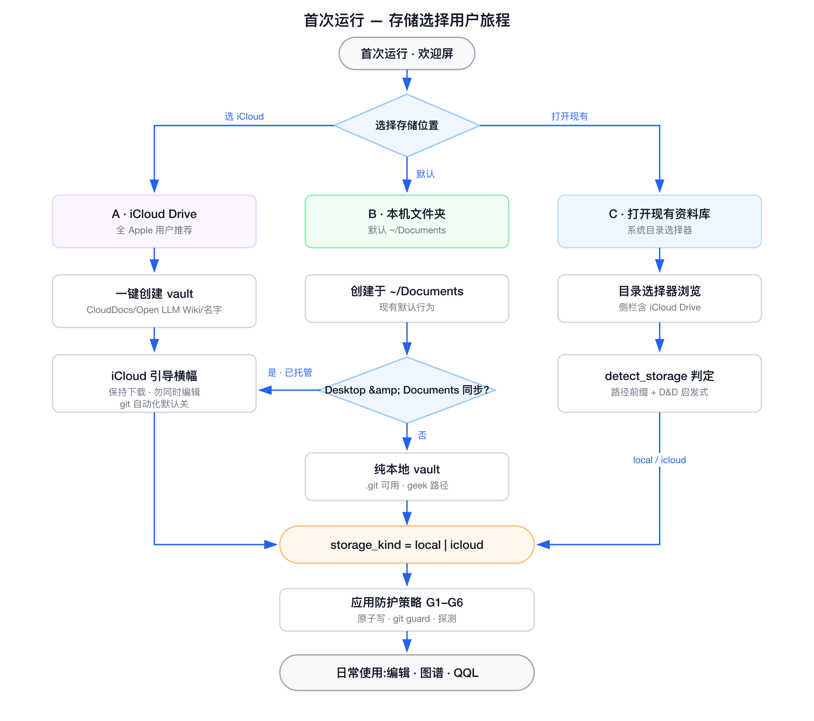
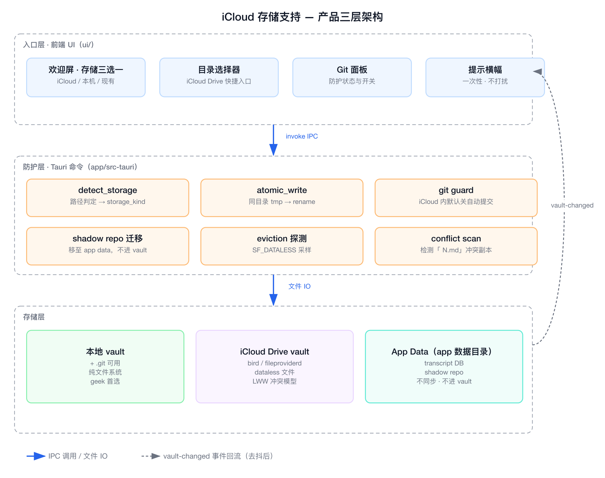
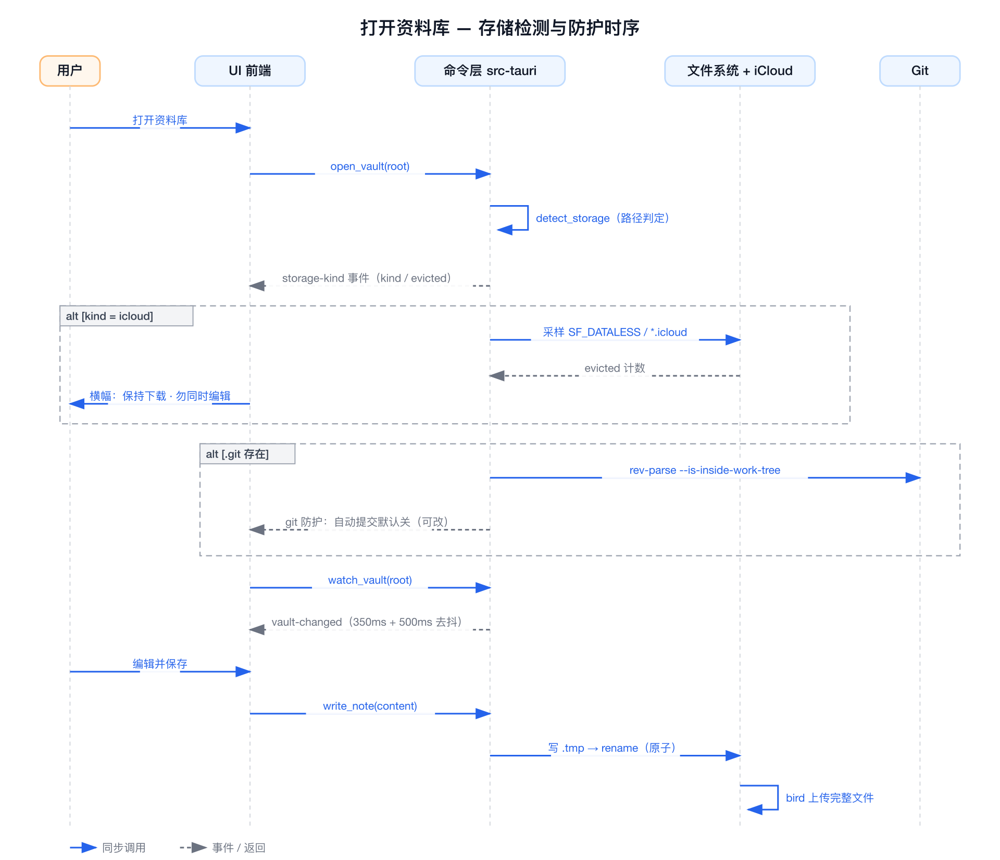

# 17 — iCloud 存储支持产品方案

- 状态:**已落地**(2026-08-21,M1+M2+M3 一次交付;G1–G6 全部实现,详见文末「落地记录」)
- 依据:[research/icloud-vault-storage.md](./research/icloud-vault-storage.md)(2026-08-21 调研,15 来源交叉验证)
- 关联代码事实:非原子写 `app/src-tauri/src/lib.rs:447`、git 自动提交 `lib.rs:1484-1502`、shadow repo `git_attr.rs:71-110`、点过滤扫描 `lib.rs:209-212`(均为落地前的行号)

## 1. 一句话方案

**"允许 + 引导 + 防护"**:iCloud Drive 成为欢迎屏上与本地文件夹并列的存储选项(非默认),后端把 iCloud 当"敌对文件系统"加六道防护,让非 geek 的全 Apple 用户零配置获得跨设备同步,同时本地 + git 的 geek 路径零打扰。



## 2. 目标与非目标

### 2.1 目标

1. 全 Apple 设备(Mac/iPhone/iPad)的非 geek 用户,创建 vault 时**一次点击**即获得跨设备同步,不引入账号、不装任何额外软件。
2. iCloud vault 与本地 vault **功能完全一致**(图谱 / QQL / Agent / 归档),没有"二等公民"功能。
3. 调研发现的四类坑(半截文件、git churn、eviction、冲突副本)全部有产品级防护,用户要么无感,要么得到一条可操作的提示。

### 2.2 非目标,与"为什么 P0 现在就要做"

- **不做自有同步服务**(不做 Obsidian Sync 克隆):超出本地优先定位,成本结构完全不同。
- **不把 iCloud 设为默认**:默认仍是本地 ~/Documents。理由:git 用户与 Windows 用户不适合 iCloud;Obsidian 在 macOS 也只把它做成选项(iOS 是沙箱所迫)。
- **不自动改用户的系统设置**(不会替用户关"优化 Mac 储存空间"),只提示。
- **不引导 Windows 用户用 iCloud for Windows**:官方生态自身承认会导致重复/损坏(见调研 §2)。
- 但注意:**P0 的三道防护不是"支持 iCloud"的前置条件,而是现状刚需**——示例库默认建在 `~/Documents`,而 macOS "Desktop & Documents" 同步开启时该路径已由 iCloud 管理。用户什么都不选,vault 就可能已经在 iCloud 里,当前代码的直写 + 自动 git commit 正暴露在调研确认的风险下。

## 3. 用户与场景

| # | 场景 | 现状 | 方案后 |
|---|------|------|--------|
| A | 新用户,Mac + iPhone,想同步 | 看不到任何同步入口,以为要装 git 或第三方网盘 | 欢迎屏选 "iCloud Drive",一键创建,得到保持下载引导 |
| B | 新用户直接点"创建示例库" | 静默写入 ~/Documents,若开了 D&D 同步则已被 iCloud 托管且无任何防护 | 打开时检测到 icloud-managed,横幅引导 + git 自动化默认关 |
| C | 老用户把现有 vault 移进 iCloud(或本来就在) | 同上,且 git 面板照常自动提交 | detect_storage 识别 → 防护生效 + 一次性横幅 |
| D | 两台设备同时编辑,出现 `Note 2.md` | 重复文件静默进索引,用户困惑 | 扫描发现冲突副本命名 → 提示卡,提供对比,绝不自动删 |
| E | geek 用户:本地目录 + git | 正常 | 零变化,零新提示(storage_kind=local 不触发任何 UI) |

## 4. 总体架构:三层



- **入口层(前端 ui/)**:欢迎屏存储三选一、目录选择器快捷入口、Git 面板防护状态、提示横幅。
- **防护层(Tauri 命令)**:六个 guard(G1–G6,见 §5)。
- **存储层**:本地 vault / iCloud Drive vault / App Data。**关键决策:shadow repo 从 vault 内迁到 App Data**(与 transcript DB 同一先例,"不进 vault / 不进 git"),一举消除 iCloud 下最大的 git churn 源,任何云盘目录通用受益。

## 5. 防护层详细设计(G1–G6)

| ID | 名称 | 触发 | 行为 | 分期 |
|----|------|------|------|------|
| G1 | 原子写 | 所有 vault 内写入(笔记 / 附件 / graph-layout / ACP 写文件) | 同目录 `.tmp` → `rename`(范式:`mcp/src/onboard.rs:395-406`)。消除半截文件被 bird 上传的风险;对本地用户也是崩溃防截断修复 | **P0** |
| G2 | detect_storage | 打开 vault / 切换 vault 时 | 返回 `storage_kind`:`local` / `icloud`(规范路径在 `~/Library/Mobile Documents/` 下)/ `icloud-managed`(路径在 `~/Documents`、`~/Desktop` 下且存在 D&D 同步目录)。**只判定,不改行为**;是所有提示与防护的开关量 | **P0** |
| G3 | git guard | `storage_kind ≠ local` 且 vault 是/将成为 git repo | 自动 commit(create/delete/rename)与 `git_init` 前置检查:默认停用并给出可操作解释;设置 `git.automation` 可显式覆写(`auto` / `off`;icloud 下初始值 `off`)。shadow repo 无条件迁出 vault,不受此开关影响 | **P0** |
| G4 | eviction 探测 | 打开 icloud vault 时,采样首层 + 索引文件的 `SF_DATALESS`(macOS)/ `*.icloud` 后缀(旧系统) | evicted 比例 > 0 → 横幅引导 "Keep Downloaded / 关闭优化储存";比例高(>30%)时在横幅中说明搜索与图谱会不完整 | **P1** |
| G5 | conflict scan | 索引扫描时 | 识别 ` xxx N.md` 命名模式(空格 + 数字,同目录存在无后缀版本)→ 提示卡列出冲突对,提供并排打开;**绝不自动合并或删除**(社区经验:副本有时才是新改动) | **P1** |
| G6 | 读超时保护 | 打开 / 预览笔记时 | 对 dataless 文件的隐式下载加超时(可取消),避免 UI 无限转圈;超时给出 "此文件仍在从 iCloud 下载" 的占位 | **P2** |

## 6. 入口层设计

### 6.1 欢迎屏:存储三选一(ASCII 示意)

```
┌────────────────────────────────────────────────────────────────┐
│            欢迎使用 Open LLM Wiki                              │
│                                                                │
│   把资料库放在哪里?                                            │
│                                                                │
│   ┌──────────────┐  ┌──────────────┐  ┌──────────────┐         │
│   │ ☁ iCloud     │  │ 💾 本机文件夹 │  │ 📂 打开现有…  │        │
│   │              │  │              │  │              │        │
│   │ iPhone/iPad  │  │ 默认          │  │ 浏览选择已有  │        │
│   │ 自动同步(推荐)│  │ ~/Documents │  │ 的资料库      │         │
│   └──────────────┘  └──────────────┘  └──────────────┘         │
│                                                                │
│   ℹ️ 需要版本历史?本机文件夹可以配合 Git 使用(进阶)           │
└────────────────────────────────────────────────────────────────┘
```

- 选 iCloud:后端解析 `~/Library/Mobile Documents/com~apple~CloudDocs/Open LLM Wiki/<名字>` 并创建。**用户永远不需要导航进隐藏的 `~/Library`**。CloudDocs 不存在(未登录 iCloud)→ 该卡片显示 "未检测到 iCloud",自动聚焦本机选项。
- 选本机:保持现状(~/Documents),创建后照常走 G2 检测(场景 B 的分支)。
- 打开现有:原生目录选择器(侧栏自带 iCloud Drive 入口),选中后走 G2。

### 6.2 打开 vault 时的检测时序



## 7. 提示层:文案与频率

原则:**storage_kind=local 时一条提示都不出现**;icloud 提示均为一次性(记录在 localStorage,键 `open-llm-wiki.storageNotice.<root-hash>`),Git 面板的防护状态是常驻状态而非弹窗。

| 提示 | 时机 | 文案(zh / en) | 频率 |
|------|------|----------------|------|
| iCloud 引导横幅 | 首次打开 icloud vault | "这个资料库在 iCloud 里:建议对资料库『保持下载』,并避免两台设备同时编辑。 / This vault lives in iCloud Drive: keep it downloaded and avoid editing on two devices at once." | 一次;触发 G4 时可再出现一次 |
| git 防护说明 | icloud vault 打开 Git 面板 / 尝试初始化 | "iCloud 与 Git 同时同步同一个文件夹会互相损坏(已知问题)。已停用自动提交,你可以仍要启用。 / Running iCloud and Git on the same folder is a known cause of corruption. Auto-commit is off; you can enable it anyway." | 常驻于 Git 面板 |
| 冲突副本提示卡 | G5 检出冲突对 | "发现可能由同步冲突产生的副本(如『Note 2.md』)。副本有时包含更新的内容,请对比后手动处理。 / Possible sync-conflict copies found. Duplicates sometimes hold newer edits — compare before deleting." | 每次检出新增对 |
| eviction 横幅 | G4 检出 evicted | "部分笔记只存在 iCloud 服务器上,搜索与图谱可能不完整。请在 Finder 中右键资料库 → 立即下载。 / Some notes are cloud-only; search and graph may be incomplete. Right-click the vault in Finder → Download Now." | 每次比例上升超过阈值 |

## 8. 后端接口(工程落点)

```rust
// 新增命令(注册进 generate_handler!)
detect_storage(root: String) -> StorageInfo
    // { kind: "local" | "icloud" | "icloud-managed",
    //   cloud_docs_root: Option<PathBuf>, evicted_ratio_hint: Option<f32> }
create_icloud_vault(name: String) -> String   // 返回 root;失败回 UI 引导本地
// 事件
emit "storage-kind" { kind, evicted }         // openVault 流程中,G4 采样后
// 设置(localStorage,ui 侧)
git.automation = "auto" | "off"               // icloud 下初始 off,UI 可改
```

改动面:`write_note_impl` / 附件 / graph-layout / ACP 写文件统一走 `atomic_write`(G1);`git_commit_paths` 与 `git_init` 加 storage gate(G3);`git_attr.rs` shadow repo 根从 `<vault>/.open-llm-wiki/agent-shadow.git` 改为 app data 下按 vault hash 命名(迁移:首启检测旧路径存在则整体搬移);扫描器对 `*.icloud` 后缀计为 evicted 并跳过解析(G4/G5 共用)。

## 9. 分期与验收

| 里程碑 | 内容 | 验收标准 |
|--------|------|----------|
| **M1(P0)防护刚需** | G1 + G2 + G3(含 shadow repo 迁移) | ① 保存过程中 `kill -9` 不产生半截 .md(tmp 残留可接受);② D&D 同步开启的机器上打开示例库出现一次横幅;③ icloud vault 内 create/delete/rename 不产生 git commit(默认);④ shadow repo 不在 vault 目录内;⑤ 全量 `cargo test -p` + typecheck + test:cov + e2e 绿 |
| **M2(P1)入口与感知** | 欢迎屏三选一 + `create_icloud_vault` + G4 + G5 | ① 未登录 iCloud 时 iCloud 卡片置灰;② 新建 iCloud vault 后 iPhone Files.app 可见;③ 人为制造 `Note 2.md` 出现提示卡;④ local vault 全程零新提示(e2e 断言) |
| **M3(P2)打磨** | G6 + Windows 云盘路径检测提示(OneDrive/iCloud for Windows 显示"不建议"横幅) + 用户文档同步矩阵 | ① dataless 文件打开有超时占位;② Windows 云盘路径出现一次性建议横幅;③ user guide 增补 "存储与同步" 一节(双语) |

## 10. 度量(匿名本地统计,遵循现有 logging 方案)

- iCloud vault 占新建 vault 比例(验证"降低非 geek 门槛"是否成立);
- G5 冲突副本检出率(衡量 iCloud 真实风险面);
- eviction 横幅出现率与用户执行 "保持下载" 后的复现率。

## 11. 关键取舍记录

| 决策 | 取 | 舍 | 理由 |
|------|----|----|------|
| iCloud 定位 | 选项 + 防护 | 默认 / 不支持 | 默认会伤害 git 与 Windows 用户;不支持则违背"降低非 geek 门槛"的调研初衷 |
| shadow repo 位置 | App Data | vault 内 `.open-llm-wiki/` | vault 内的 bare repo 是 iCloud 下最高频损坏源;App Data 有 transcript DB 先例 |
| git 自动化策略 | icloud 默认 off,可覆写 | 强制禁止 / 照常开启 | 强制禁止伤害高级用户;照常开启把调研确认的损坏风险留给用户 |
| 冲突副本 | 检测 + 提示 + 对比 | 自动合并 / 自动删 | 无冲突语义可依赖(LWW 不可信);自动删可能删掉新改动 |
| 同步方案 | 借力 iCloud 文件同步 | 自建同步 / 绑定某云盘 SDK | 与"文件即真相"一致;iCloud 之外(Dropbox 等)因同为文件夹同步,防护层天然通用 |

## 12. 开放问题(已全部拍板)

1. ~~`icloud-managed` 下 git guard 是否一刀切~~ → **拍板(2026-08-21):宽松**。`icloud-managed` 不关 git 自动化,只提示(`core::git_auto_allowed` 矩阵);严格 `icloud` 才默认关、可显式开启。
2. ~~欢迎屏三选一与 MG 叙事如何嵌合~~ → **拍板:不做三卡片重构**,在现有欢迎屏按钮列加一枚"在 iCloud 中创建"入口(MG 叙事不动)。
3. ~~eviction 采样时机~~ → **拍板:不重要,用默认**(打开 vault 时一次,有界 200 样本)。

## 13. 落地记录(2026-08-21)

M1+M2+M3 一次交付,TDD(测试先行:core 12 例 + app 20 例 + ui 组件/纯逻辑新增 ~20 例 + e2e 3 例):

| 层 | 交付物 |
|----|--------|
| core | `core/src/storage.rs`:`classify_storage`(四类别)/ `is_icloud_stub` / `conflict_pairs` / `git_auto_allowed`(IC-1 宽松矩阵),单测 + proptest |
| app | `app/src-tauri/src/storage.rs`:`atomic_write`(tmp+fsync+rename)接入全部写入点(write_note/附件/graph-layout/改名重写/示例库种子/ACP agent 写);`detect_storage`(探测 + eviction 有界采样:`.icloud` stub 与 macOS `SF_DATALESS` via libc);`create_icloud_vault`(CloudDocs 下唯一命名);`set_git_automation` 覆写;`scan_conflicts`;`read_to_string_timeout`(10s,fifo 阻塞真测);git 闸门接入 `git_commit_paths`/`git_init`(端到端测试:icloud 拦 / managed 放行 / 显式开启恢复) |
| app | shadow repo 迁移:`git_attr.rs` 新位置 app data `agent-shadow/<fnv>.git`,v1 vault 内旧位置自动搬(rename→copy 兜底,幂等) |
| ui | `storage-notice.ts`(一次性横幅键 / git 覆写三态 / 冲突忽略清单);`StorageBanner` / `ConflictNotice` 组件;`WelcomeEmpty` iCloud 入口;`GitPanel` 防护区;mock 支持 `?mock-storage=` 覆写(e2e 用);store 接线(openVault 探测 + watcher 批次后冲突重扫 + 覆写恢复) |
| docs | FEATURE-INDEX「存储防护」节;user how-to 双语"Store the vault in iCloud"(行数对齐);本节 |

**完整性审计补齐(同日)**:对照 §9 验收逐条复查后补了五处 —— ① `mcp/onboard.rs` wiki-starter 种子与 skill 写 vault 改原子写;② 新增 `icloud_available` 命令,欢迎屏未登录 iCloud 时入口**置灰**并说明(M2 验收原文);③ Git 面板防护变双向开关(启用后可「停用自动提交」);④ eviction 按"已关闭时计数"记忆,未下载计数**上涨时横幅重新出现**(§7 承诺的"触发 G4 时可再出现一次");⑤ §10 度量落进现有 logging(detect_storage / scan_conflicts / create_icloud_vault 打点)。仍待实机的两项:iPhone Files.app 可见性、SF_DATALESS 采样真机表现(见 §14)。

## 14. 实机验证清单(代码之外的验收)

1. 开启 Desktop & Documents 同步的 Mac:打开 `~/Documents` 下的示例库 → 出现一次 `icloud-managed` 横幅;git 自动提交照常(宽松)。
2. 手动把 vault 放进 `Mobile Documents` → `icloud` 横幅 + Git 面板防护区;建/删/改名不产生自动提交;「仍要启用」后恢复。
3. 未登录 iCloud 的机器:欢迎屏 iCloud 入口置灰。
4. iCloud 空间紧张/开启"优化储存"的机器:eviction 行出现,计数上涨会再次提醒。
5. iPhone Files.app 能看到新建的 iCloud vault。
6. Windows(装 OneDrive / iCloud for Windows):出"云盘不建议"横幅。
