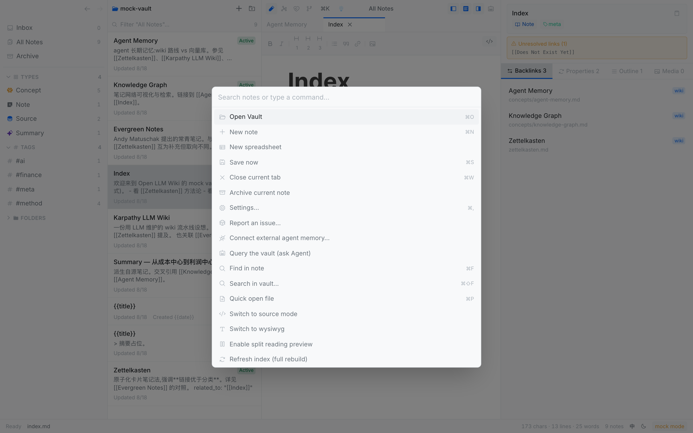
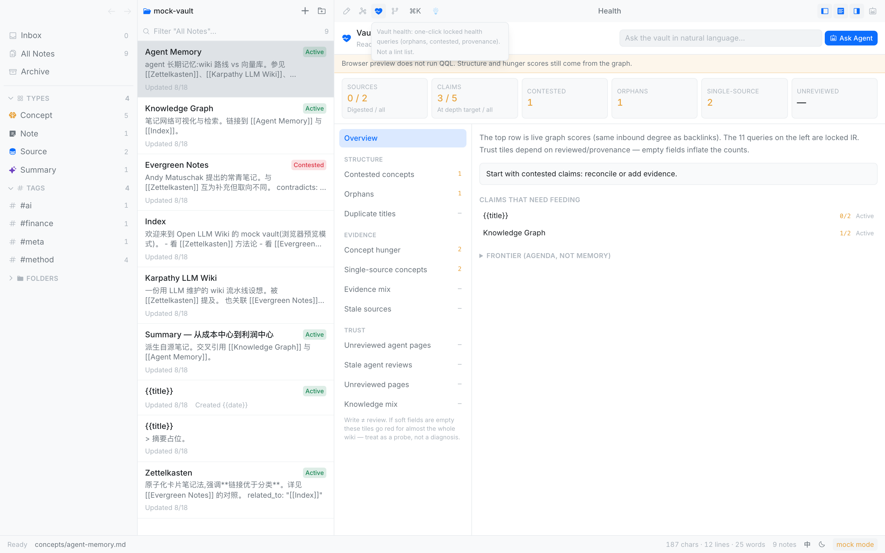
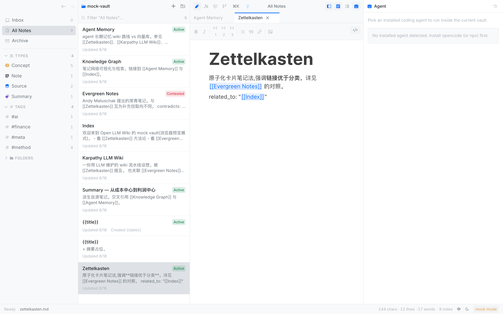

# How-to guides

<!-- README-I18N:START -->

**English** | [简体中文](./how-to.zh.md)

<!-- README-I18N:END -->

Each section is one job. First time in the app? Use the [tutorial](./tutorial.md).

| Job | Jump |
| --- | --- |
| Open a folder | [Open or switch a vault](#open-or-switch-a-vault) |
| Write and link | [Create a note](#create-a-note) · [Wikilink](#link-two-notes-with-a-wikilink) |
| Find things | [Editor, find, split](#switch-editor-mode-find-split-preview) · [Palette](#use-the-command-palette) |
| See the graph | [Graph](#read-the-graph-and-jump-to-a-note) · [Health](#read-vault-health-and-pick-the-next-action) |
| Use it as AI memory | [Attach the vault](#use-this-vault-as-ai-memory) |
| Grow the wiki | [Distill a source](#distill-a-source-into-the-wiki) |

## Open or switch a vault

1. Press `⌘O`, or the folder-plus control in the list header, or `⌘K` → **Open Vault**.
2. Choose a Markdown folder on disk.
3. Recently opened vaults appear on the welcome screen — click one.

You can also drop a folder onto the welcome screen.

## Create a note

1. Press `⌘N`, or the `+` in the list header.
2. An inline title field appears. Rename it and press Enter.
3. Write in the body. Default mode is WYSIWYG; the `</>` control switches to source.

The app autosaves. The status bar shows the current path.

## Link two notes with a wikilink

In source or WYSIWYG type:

```md
See [[Title of the other note]]
```

`[[` opens title completion. Click a link to follow it. **Backlinks** on the right lists who points here.

Relations also belong in frontmatter:

```yaml
related_to: "[[Index]]"
contradicts: "[[Zettelkasten]]"
```

Both show up on the graph. Broken targets get a yellow inspector banner.

## Switch editor mode, find, split preview

| You want | Do this |
| --- | --- |
| Source | Click `</>`, or `⌘K` → switch to source |
| WYSIWYG | Click again, or `⌘K` → switch to WYSIWYG |
| Find in this note | `⌘F` |
| Search the vault | `⌘⇧F` |
| Quick-open by title | `⌘P` |
| Source beside reading | `⌘K` → turn on split reading preview |

`⌘F` never changes your default edit mode.

## Insert an image

Paste, drag, or use the image button on the format bar. Files land under `attachments/` in the vault (default: a folder per note). The body stores a relative path, not a data URL.

To remove unreferenced files: `⌘K` and search for “orphan” or “clean”.

## Use the command palette

`⌘K` opens the command list. Type to filter. Frequent items: Open Vault, Settings, User guide, Connect external agent memory, Distill into Wiki, Query vault, Report an issue.



`⌘P` only quick-opens files. `⌘⇧F` only searches bodies. Do not mix them up with `⌘K`.

## Read the graph and jump to a note

1. Click **Graph** in the toolbar.
2. Drag to pan, scroll to zoom, click a node for the bottom card.
3. **Filter** narrows by type / tag. **More** holds layouts (force / type layers / timeline).
4. Click the card or node to open that note.

Canvas files (`.canvas`) are a separate whiteboard. They are not on the graph and have no New button. Existing `.canvas` files still open for editing.

## Read vault health and pick the next action

1. Click the heartbeat icon.
2. Read the six tiles and the next-action line first.
3. The eleven items on the left are grouped as structure / evidence / trust. Open one for detail.
4. Type a natural-language question at the top right and click **Ask Agent**. Do not write a query by hand.



Hunger targets: an `Active` concept wants at least two inbound links; `Contested` wants at least three. Short rows are highlighted.

## Use this vault as AI memory

The folder is the memory. Chat logs are not. Attach an agent to the same files you browse.

### One-click for Cursor / Claude Code / others

1. `⌘,` → **Agent memory** → one-click connect.
2. The app writes user-level MCP config for the agents it finds, installs the `wiki-ingest` skill into this vault, and can seed wiki-starter if the folder is empty.

CLI equivalent (published on npm; the GitHub line installs the latest source):

```bash
# in the vault root
npx --yes open-llm-wiki-skills install . --hooks

# or, straight from this repository:
# npx --yes --package=github:rhythm1995/open-llm-wiki#path:packages/open-llm-wiki-skills \
#   open-llm-wiki-skills install . --hooks
```

The agent then has eight tools: `list_notes`, `read_note`, `write_note`, `links`, `search_notes`, `run_qql`, `vault_info`, `lint_vault`. See the [reference](./reference.md#mcp-tools).

### In-app sidebar

1. Toggle the Agent pane (robot control, top right).
2. Pick a recipe installed on this machine (opencode, claude-code, …).
3. `@`-mention the current note or others.
4. Send. Tool calls fold into cards. Permissions are three-tier: ask every time / relaxed / high-risk still gated.



**Query vault** (`⌘K`) seeds a short natural-language instruction. It does not open a query editor.

### What the agent should read first

Cheap order: `hot.md` → `index.md` → then `read_note` / `links` as needed. Do not start with a full-vault search.

`hot.md` is a short cache at the vault root, rewritten as a whole page — not a log. After a turn that wrote the vault, the in-app agent asks you to rewrite it. It does not write it for you.

A useful answer that should survive the chat: write it as a new note. That is how memory compounds.

## Distill a source into the wiki

Use this when you have a `type: Source` (or untyped material) and you want an agent to produce Summary / Entity / Concept pages from it. Attach memory first ([above](#use-this-vault-as-ai-memory)).

1. Open that note.
2. `⌘K` → **Distill into Wiki**, or the distill control on the note.
3. Pick an installed agent and send.

The agent should follow wiki-ingest: write a new Summary, mark the Source `Digested`, create Entity / Concept pages, and add a line to `index.md`. It must not rewrite the Source body.

## Store the vault in iCloud

1. On the welcome screen, click **Create in iCloud**. The vault is created under iCloud Drive → `Open LLM Wiki`.
2. Keep the vault downloaded: right-click it in Finder → **Download Now**, and consider turning off "Optimize Mac Storage" in System Settings.
3. Avoid editing the same note on two devices at once. Conflicts show up as "Name 2.md" copies — the app flags them for you to compare, and never merges or deletes on its own.
4. Git auto-commit is off by default in iCloud vaults (iCloud and Git syncing one folder is a known cause of corruption). You can enable it in the Git panel.

## Change language, theme, default edit mode

`⌘,` opens Settings. Dark / light theme, 简体中文 / English UI, default source / wysiwyg, and attachment layout live there. Everything stays on this machine.

The `EN` / `中` control in the status bar switches the UI language immediately.

## Report a problem

Help → **Report Issue…**, or `⌘K` → **Report an issue**, or the card in the help guide, or Settings → Diagnostics. That opens [GitHub Issues](https://github.com/rhythm1995/open-llm-wiki/issues). Export diagnostic logs from Settings first.
