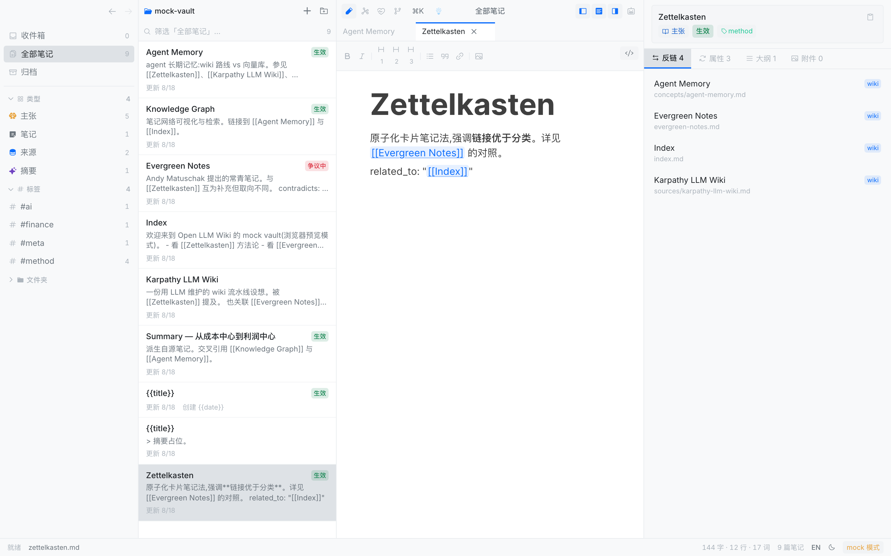
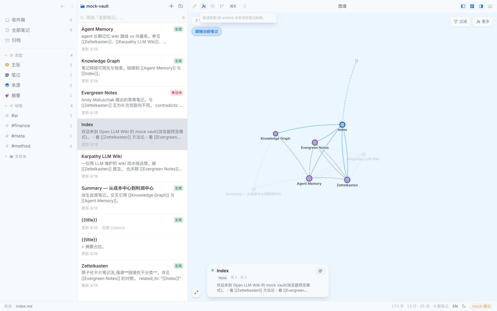
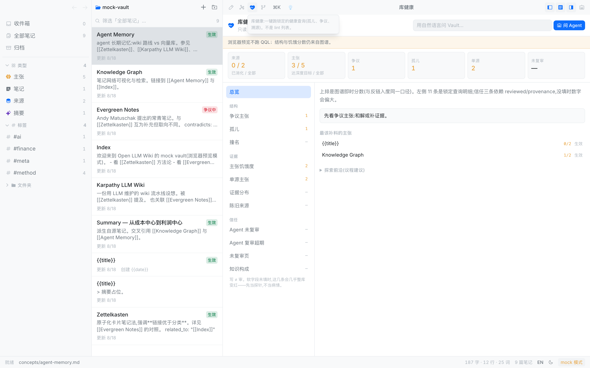
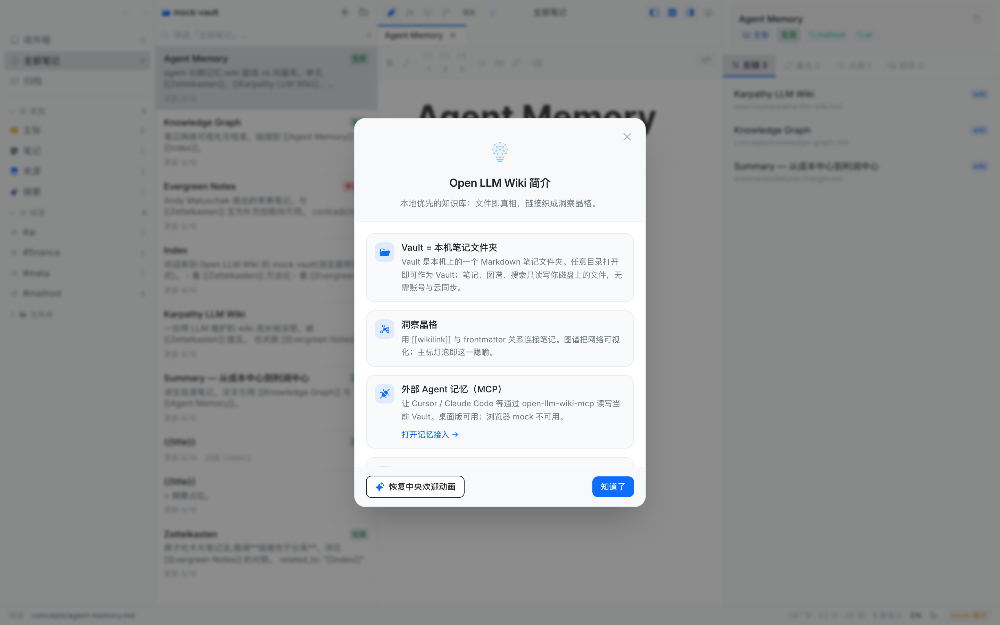

# 教程：十五分钟走进一座库

<!-- README-I18N:START -->

[English](./tutorial.md) | **简体中文**

<!-- README-I18N:END -->

这是一堂课，不是菜单说明书。做完你应该：打开一座库、读一篇笔记、顺着链接跳到另一篇、在图谱里看见它们连在一起。

需要：一台 Mac（或已跑起来的浏览器预览）、大约十五分钟。不要同时改设置、不要同时接 Agent——那些放到 [操作指南](./how-to.zh.md)。

## 1. 打开应用

**桌面：** 启动 Open LLM Wiki。若是第一次从源码打的未签名包，系统可能拦一下：系统设置 → 隐私与安全性 → 仍要打开，或：

```bash
xattr -cr "/Applications/Open LLM Wiki.app"
```

**浏览器预览（开发用）：**

```bash
pnpm --dir ui dev
```

打开 <http://localhost:5173>。预览会自动载入一座演示库，你可以直接从第 3 步开始。

## 2. 打开一座 Vault

欢迎台主按钮是「打开 Markdown 文件夹」。选本机任意放 `.md` 的目录。

也可以点「创建示例知识库」：应用会种下一份 wiki-starter（类型契约、`index.md`、`hot.md`、健康查询模板）。

> [!TIP]
> Vault 不是账号，也不是云盘。它就是那个文件夹。换电脑时把文件夹拷走即可。

## 3. 打开一篇笔记

左侧是导航（全部笔记 / 类型 / 标签），中间是列表，中间偏右是正文，最右是属性与反链。

1. 在列表里点一篇笔记。默认是所见即所得。
2. 看右侧 **反链**：谁链到了这篇。
3. 正文里的蓝色 `[[链接]]` 可以点。



试着点开一篇带「主张 / Concept」标签的笔记。你应该能看见类型芯片、状态（例如「生效」或「争议中」），以及至少一条反链。

## 4. 跟着链接走

1. 在正文里点一个 wikilink。
2. 标签栏会出现新笔记；用顶栏左侧的后退回到刚才那篇。
3. 若链接指向还不存在的笔记，右侧会出一条黄色「未解析链接」提示——这是正常的，以后补上那篇即可。

你刚刚做的就是这座应用的基本动作：**读 → 跟链接 → 再读**。

## 5. 看一眼图谱

点顶栏里「图谱」图标（心形左边、编辑器右边那一组里的图网络标）。



- 每个圆是一篇笔记。
- 线是 `[[wikilink]]` 或 frontmatter 里的关系。
- 点一个节点，底部卡片显示类型和度数。
- 「跟随当前笔记」会把镜头留在你正在看的那篇附近。

如果你刚从一篇笔记跳过来，图上应该能看见它和邻居。这就是「洞察晶格」——链接织成的网，不是文件夹树。

## 6. 看一眼库健康

点顶栏心跳图标，打开「库健康」。



先看上面六格（来源消化、主张达标、争议、孤儿、单源、未复审）和「下一步」。不要去学左边那 11 条查询怎么写。

浏览器预览会提示不跑 QQL；分数仍来自图谱。桌面端会在后台把 11 条跑完，左边出现角标。

## 你已经会了

你现在会：打开库、读笔记、跟链接、看图谱、看健康。下一步按需要选：

- 写笔记、插图、提炼来源、接 Agent → [操作指南](./how-to.zh.md)
- 查快捷键 → [参考](./reference.zh.md)
- 想理解类型和 `status` → [概念](./concepts.zh.md)

卡壳时点顶栏 logo，打开应用内简介。


